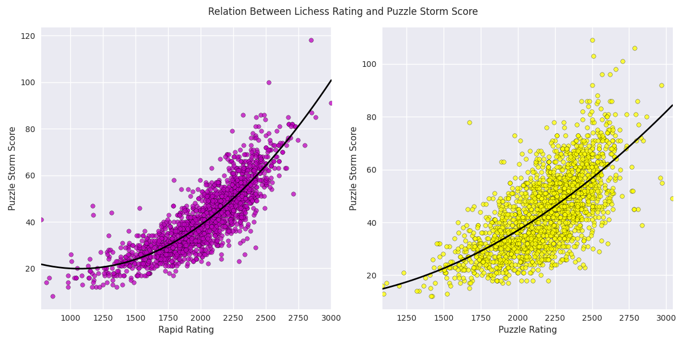

# Lichess Puzzle Storm Analysis
_______________________________

This is a Data Analysis project I've wanted to do since [Lichess](https://lichess.org) launched the [Puzzle Storm Feature](https://lichess.org/storm). If you are a Lichess player and want to know how good/bad your score is this is your place!

## Methodology

This study was possible thanks to [Lichess Database](https://database.lichess.org/#standard_games) and [Lichess API](https://lichess.org/api)

This project was done following these steps

1. A small portion of the Database was downloaded
2. For every game, the username of both players was extracted (remove duplicates!)
3. For every user, the API was called to get the current rating and puzzle storm score
4. Only users who had more than 50 tries in puzzle storm and also had an well established rating in either Bullet/Blitz were considered
5. The plots were made using [matplotlib](https://matplotlib.org/) and Data Analysis with [numpy](https://numpy.org/) and [pandas](https://pandas.pydata.org/)

## Results
### Bullet and Blitz

____________________________________________________
### Correlation
Bullet has a correlation coefficient of 0.860 when compared with Puzzle Storm Score, while Blitz coefficient is 0.866 

### Curves of Best Fit
Using quadratic regression we get the equations for the following parabolas where Y is your Puzzle Storm Score and X is your Bullet/Blitz Rating:  

For Bullet   

 $y = 0.00001435x^2 - 0.022443018x + 32.13729$ 
   

For Blitz     

 $y = 0.000018761x^2 - 0.0346802x + 36.9330$ 
   

### Rapid and Puzzle

___________________________________________________

*These results were less conclusive*

### Correlation 
Rapid has a correlation coefficient of 0.835 when compared with Puzzle Storm Score, while Blitz coefficient is 0.684

### Curves of Best fit
For Rapid

 $y = 0.00002173x^2 -0.0465462x + 44.7887$ 
   

For Puzzle Rating

 $y = 0.00001084x^2 - 0.00921613x + 12.01960$ 
   

 ## Run this project
   
To run this project you will need to install [NodeJS](https://nodejs.org/en/) and [npm](https://www.npmjs.com/), then:

1. Clone this project 
2. Open a terminal and run `npm install` from the project folder

This project was divided into 3 files with different purposes:
* **getUsers.js**: It will take a Lichess pgn file as an input and will output a file with a list of lichess users
* **getData.js**: It will take a list of Lichess users, call the API, filter the ones we are looking for, and finally will output a .jsonl file with the users data
* **JSONtoCSV.js** It will take a .jsonl file and output one/various .csv files